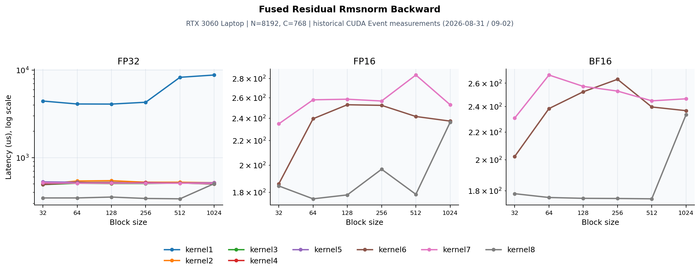

# CUDA Fused Residual RMSNorm Backward

源码：[dev/cuda/fused_residual_rmsnorm_backward.cu](../dev/cuda/fused_residual_rmsnorm_backward.cu)。本页整理2026-08-31/09-02的历史测量，硬件为RTX 3060 Laptop、SM86、N=8192、C=768。**本次目录迁移没有重测CUDA RMSNorm性能**；迁移前后算子主体保持一致。历史记录不自动代表后续代码编辑后的性能。



## 数学与实现

`s=sum(dy*w*z); dz=r*(dy*w-z*r²*s/C); dx=dresidual=dz; dw=sum_rows(dy*z*r)`。归约使用FP32，输入/输出覆盖FP32、FP16和BF16；低精度存储与转换的位置以源码为准。

warp归约 → shared dw聚合 → persistent与vec2 → 混合精度 → kernel8的寄存器累计、分层归并。

## CUDA Event测量

三张子图分别为FP32/FP16/BF16，x为block size，y为平均耗时μs，采用对数轴以保留naive与优化版的差距。每条线只使用实际有记录的dtype/版本。block256的朴素/最新版本：

| 版本 | dtype | 耗时 (μs) | 有效带宽 (GB/s) |
|---|---|---:|---:|
| kernel1 | FP32 | 4305.40 | 29.23 |
| kernel8 | FP32 | 341.50 | 368.53 |
| kernel8 | FP16 | 196.90 | 319.78 |
| kernel8 | BF16 | 175.30 | 359.18 |

扫描到的历史最佳点：

- FP32：kernel8、block512，338.30 μs，逻辑有效带宽372.10 GB/s。
- FP16：kernel8、block64，175.50 μs，逻辑有效带宽358.67 GB/s。
- BF16：kernel8、block512，175.10 μs，逻辑有效带宽359.57 GB/s。

前向benchmark每点2000次，反向100次；原计时清理L2。这里的带宽按程序逻辑必要流量计算，不能当作物理DRAM流量。

## Profiler证据与判断

NCU使用同一历史硬件/形状、block256，采集单次kernel。NCU Duration与Event均值属于不同测量，下面保留原报告的指标口径。

| 版本 | Duration (μs) | DRAM (%) | Compute (%) | Occupancy (%) | Registers |
|---|---:|---:|---:|---:|---:|
| kernel1 FP32 | 5330.00 | 19.36 | 4.60 | 18.63 | 38 |
| kernel2 FP32 | 488.35 | 91.97 | 21.33 | 83.55 | 39 |
| kernel3 FP32 | 499.71 | 91.12 | 22.92 | 98.91 | 38 |
| kernel4 FP32 | **478.62** | **93.22** | 22.96 | 92.68 | 39 |
| kernel5 FP32 | 495.46 | 91.86 | 17.18 | 82.33 | 44 |
| kernel6 FP32 | 492.19 | 92.63 | 19.79 | 96.95 | 38 |
| kernel7 FP32 | 497.25 | 90.83 | 18.00 | 78.60 | 44 |
| kernel6 FP16 | 238.66 | 90.98 | 41.56 | 95.93 | 39 |
| kernel6 BF16 | **234.02** | 90.75 | 41.99 | 94.44 | 39 |
| kernel7 FP16 | 248.77 | 87.81 | 31.20 | 85.13 | 47 |
| kernel7 BF16 | 246.85 | 85.19 | 31.29 | 83.59 | 46 |
| kernel8 FP32 | **331.46** | 90.94 | 12.69 | 29.69 | 128 |
| kernel8 FP16 | **162.18** | **90.30** | 30.64 | 30.32 | 114 |
| kernel8 BF16 | **168.54** | 88.06 | 30.11 | 32.69 | 114 |

两个输入梯度相同，但程序仍分别写回dx与dresidual。重点在dw聚合和减少读写/原子开销，不能仅凭低occupancy认定实现更慢。 profiler数据支持归约、访存和原子聚合的分析，但缓存、寄存器和调度策略互相影响，不能把总收益精确分配给某条指令。

## 验证与复现范围

历史日志记录CPU对拍与混合精度误差检查。本次再次编译迁移后的源码；目录/注释路径调整未改变数学实现。

从仓库根目录可执行：

```bash
mkdir -p result/build
nvcc -O3 -std=c++17 -arch=sm_89 dev/cuda/fused_residual_rmsnorm_backward.cu -o result/build/fused_residual_rmsnorm_backward
./result/build/fused_residual_rmsnorm_backward 1
```

历史3060 Laptop应使用`-arch=sm_86`；新4090D使用`sm_89`。硬件或shape变化后应重新测量，不能沿用图中的排序。
