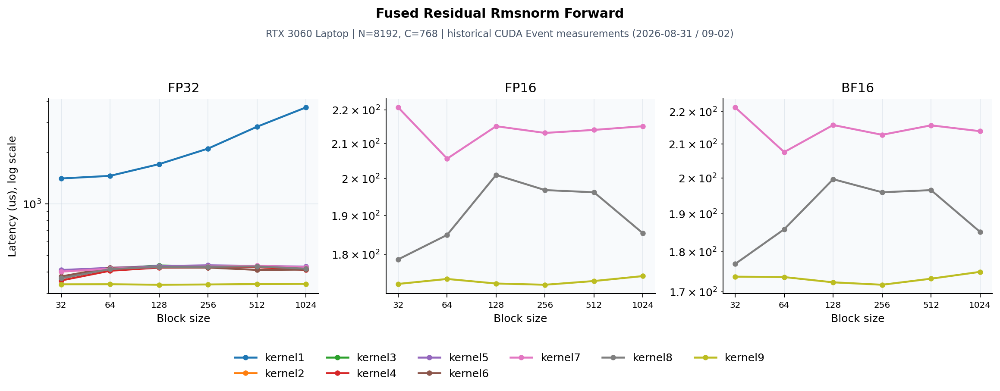

# CUDA Fused Residual RMSNorm Forward

源码：[dev/cuda/fused_residual_rmsnorm_forward.cu](../dev/cuda/fused_residual_rmsnorm_forward.cu)。本页整理2026-08-31/09-02的历史测量，硬件为RTX 3060 Laptop、SM86、N=8192、C=768。**本次目录迁移没有重测CUDA RMSNorm性能**；迁移前后算子主体保持一致。历史记录不自动代表后续代码编辑后的性能。



## 数学与实现

`z=round_to_storage(x+residual); y=z*w*rsqrt(mean(z²)+eps)`。归约使用FP32，输入/输出覆盖FP32、FP16和BF16；低精度存储与转换的位置以源码为准。

一线程一行 → warp → float2/float4 → shared/cache → grid-stride → 混合精度 → kernel9缓存z并直接写回。

## CUDA Event测量

三张子图分别为FP32/FP16/BF16，x为block size，y为平均耗时μs，采用对数轴以保留naive与优化版的差距。每条线只使用实际有记录的dtype/版本。block256的朴素/最新版本：

| 版本 | dtype | 耗时 (μs) | 有效带宽 (GB/s) |
|---|---|---:|---:|
| kernel1 | FP32 | 2112.40 | 47.67 |
| kernel9 | FP32 | 338.20 | 297.78 |
| kernel9 | FP16 | 172.50 | 291.94 |
| kernel9 | BF16 | 171.70 | 293.38 |

扫描到的历史最佳点：

- FP32：kernel9、block128，336.90 μs，逻辑有效带宽298.90 GB/s。
- FP16：kernel9、block256，172.50 μs，逻辑有效带宽291.94 GB/s。
- BF16：kernel9、block256，171.70 μs，逻辑有效带宽293.38 GB/s。

前向benchmark每点2000次，反向100次；原计时清理L2。这里的带宽按程序逻辑必要流量计算，不能当作物理DRAM流量。

## Profiler证据与判断

NCU使用同一历史硬件/形状、block256，采集单次kernel。NCU Duration与Event均值属于不同测量，下面保留原报告的指标口径。

| 版本 | Duration (μs) | DRAM (%) | Compute (%) | Occupancy (%) | Registers |
|---|---:|---:|---:|---:|---:|
| kernel1 FP32 | 2680.00 | 16.82 | 3.43 | 18.63 | 40 |
| kernel2 FP32 | **410.72** | 91.08 | 13.85 | 86.97 | 40 |
| kernel3 FP32 | 424.06 | 88.83 | 7.28 | 86.53 | 37 |
| kernel4 FP32 | 411.01 | **91.53** | 4.00 | 89.26 | 36 |
| kernel5 FP32 | 412.83 | 90.62 | 14.48 | 87.46 | 40 |
| kernel6 FP32 | 422.40 | 89.39 | 4.24 | 83.94 | 48 |
| kernel7 FP32 | 413.47 | 91.06 | 13.91 | 89.84 | 40 |
| kernel8 FP32 | 415.33 | 90.70 | 7.21 | 86.88 | 37 |
| kernel7 FP16 | 203.52 | 86.62 | 28.43 | 90.62 | 24 |
| kernel7 BF16 | 203.01 | 86.80 | 28.27 | 90.56 | 25 |
| kernel8 FP16 | **185.79** | **89.12** | 16.42 | 78.28 | 24 |
| kernel8 BF16 | 192.22 | 87.29 | 16.14 | 78.38 | 24 |
| kernel9 FP32 | **332.38** | 90.97 | 4.43 | 58.16 | 55 |
| kernel9 FP16 | **161.25** | 91.57 | 15.64 | 90.84 | 40 |
| kernel9 BF16 | **159.94** | **92.26** | 15.93 | 89.79 | 40 |

融合后仍需保存z与mean2供反向使用。寄存器缓存z避免归约结束后重读x/residual；比较时要核对加法舍入位置与输出定义。 profiler数据支持归约、访存和原子聚合的分析，但缓存、寄存器和调度策略互相影响，不能把总收益精确分配给某条指令。

## 验证与复现范围

历史日志记录CPU对拍与混合精度误差检查。本次再次编译迁移后的源码；目录/注释路径调整未改变数学实现。

从仓库根目录可执行：

```bash
mkdir -p result/build
nvcc -O3 -std=c++17 -arch=sm_89 dev/cuda/fused_residual_rmsnorm_forward.cu -o result/build/fused_residual_rmsnorm_forward
./result/build/fused_residual_rmsnorm_forward 1
```

历史3060 Laptop应使用`-arch=sm_86`；新4090D使用`sm_89`。硬件或shape变化后应重新测量，不能沿用图中的排序。
