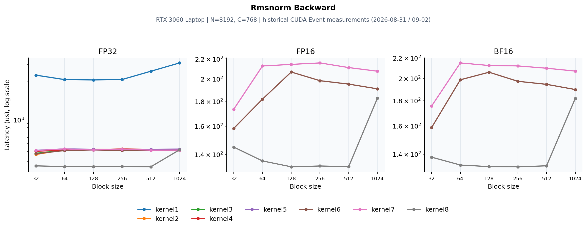

# CUDA RMSNorm Backward

源码：[dev/cuda/rmsnorm_backward.cu](../dev/cuda/rmsnorm_backward.cu)。本页整理2026-08-31/09-02的历史测量，硬件为RTX 3060 Laptop、SM86、N=8192、C=768。**本次目录迁移没有重测CUDA RMSNorm性能**；迁移前后算子主体保持一致。历史记录不自动代表后续代码编辑后的性能。



## 数学与实现

`r=rsqrt(mean(x²)+eps); s=sum(dy*w*x); dx=r*(dy*w-x*r²*s/C); dw=sum_rows(dy*x*r)`。归约使用FP32，输入/输出覆盖FP32、FP16和BF16；低精度存储与转换的位置以源码为准。

逐元素全局atomic → warp行内归约 → block聚合dw → persistent/vec2 → 三精度专用kernel8的寄存器累计与分层归并。

## CUDA Event测量

三张子图分别为FP32/FP16/BF16，x为block size，y为平均耗时μs，采用对数轴以保留naive与优化版的差距。每条线只使用实际有记录的dtype/版本。block256的朴素/最新版本：

| 版本 | dtype | 耗时 (μs) | 有效带宽 (GB/s) |
|---|---|---:|---:|
| kernel1 | FP32 | 3215.40 | 23.49 |
| kernel8 | FP32 | 259.10 | 291.51 |
| kernel8 | FP16 | 132.60 | 285.06 |
| kernel8 | BF16 | 132.00 | 286.29 |

扫描到的历史最佳点：

- FP32：kernel8、block512，256.90 μs，逻辑有效带宽294.08 GB/s。
- FP16：kernel8、block128，132.10 μs，逻辑有效带宽286.03 GB/s。
- BF16：kernel8、block256，132.00 μs，逻辑有效带宽286.29 GB/s。

前向benchmark每点2000次，反向100次；原计时清理L2。这里的带宽按程序逻辑必要流量计算，不能当作物理DRAM流量。

## Profiler证据与判断

NCU使用同一历史硬件/形状、block256，采集单次kernel。NCU Duration与Event均值属于不同测量，下面保留原报告的指标口径。

| 版本 | Duration (μs) | DRAM (%) | Compute (%) | Occupancy (%) | Registers |
|---|---:|---:|---:|---:|---:|
| kernel1 FP32 | 4520.00 | 10.50 | 4.05 | 17.71 | 38 |
| kernel2 FP32 | 421.12 | 89.34 | 22.20 | 86.07 | 39 |
| kernel3 FP32 | 403.62 | 93.45 | 26.68 | 95.74 | 38 |
| kernel4 FP32 | 408.13 | 92.19 | 25.51 | 95.72 | 39 |
| kernel5 FP32 | 408.26 | 92.74 | 18.65 | 81.77 | 43 |
| kernel6 FP32 | 407.94 | 92.57 | 22.18 | 98.61 | 38 |
| kernel7 FP32 | **403.26** | **93.79** | 19.01 | 79.35 | 43 |
| kernel6 FP16 | 196.16 | 88.79 | 46.41 | 96.55 | 38 |
| kernel6 BF16 | **193.41** | 88.89 | 46.77 | 95.77 | 39 |
| kernel7 FP16 | 200.03 | 91.62 | 36.84 | 96.59 | 40 |
| kernel7 BF16 | 200.74 | 91.11 | 36.35 | 96.53 | 40 |
| kernel8 FP32 | **254.11** | 89.05 | 13.32 | 31.83 | 128 |
| kernel8 FP16 | **122.43** | 89.63 | 33.21 | 31.19 | 114 |
| kernel8 BF16 | **125.41** | 88.19 | 33.93 | 32.25 | 116 |

dw是跨行归约。减少全局/共享原子次数比只提高occupancy更重要；两阶段partial-dw归约还需要计入额外launch和workspace。 profiler数据支持归约、访存和原子聚合的分析，但缓存、寄存器和调度策略互相影响，不能把总收益精确分配给某条指令。

## 验证与复现范围

历史日志记录CPU对拍与混合精度误差检查。本次再次编译迁移后的源码；目录/注释路径调整未改变数学实现。

从仓库根目录可执行：

```bash
mkdir -p result/build
nvcc -O3 -std=c++17 -arch=sm_89 dev/cuda/rmsnorm_backward.cu -o result/build/rmsnorm_backward
./result/build/rmsnorm_backward 1
```

历史3060 Laptop应使用`-arch=sm_86`；新4090D使用`sm_89`。硬件或shape变化后应重新测量，不能沿用图中的排序。
