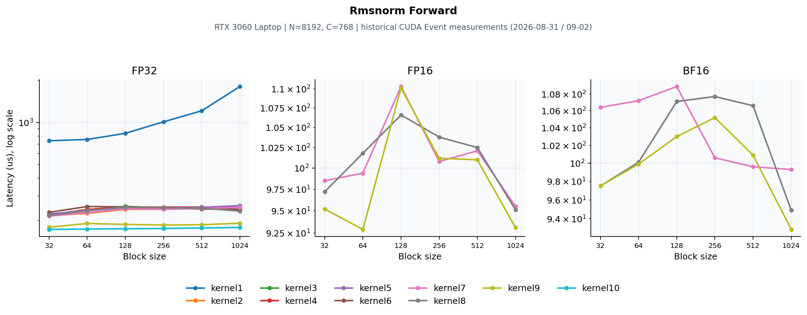

# CUDA RMSNorm Forward

源码：[dev/cuda/rmsnorm_forward.cu](../dev/cuda/rmsnorm_forward.cu)。本页整理2026-08-31/09-02的历史测量，硬件为RTX 3060 Laptop、SM86、N=8192、C=768。**本次目录迁移没有重测CUDA RMSNorm性能**；迁移前后算子主体保持一致。历史记录不自动代表后续代码编辑后的性能。



## 数学与实现

`y=x*w*rsqrt(mean(x²)+eps)`。归约使用FP32，输入/输出覆盖FP32、FP16和BF16；低精度存储与转换的位置以源码为准。

warp归约 → float2/float4 → shared权重缓存 → grid-stride → 混合精度 → shared/register single-pass。kernel10为FP32寄存器缓存路径；FP16/BF16不强行采用同样的分块。

## CUDA Event测量

三张子图分别为FP32/FP16/BF16，x为block size，y为平均耗时μs，采用对数轴以保留naive与优化版的差距。每条线只使用实际有记录的dtype/版本。block256的朴素/最新版本：

| 版本 | dtype | 耗时 (μs) | 有效带宽 (GB/s) |
|---|---|---:|---:|
| kernel1 | FP32 | 1012.40 | 49.71 |
| kernel10 | FP32 | 175.10 | 287.45 |
| kernel9 | FP16 | 101.20 | 248.56 |
| kernel9 | BF16 | 105.20 | 239.13 |

扫描到的历史最佳点：

- FP32：kernel10、block32，172.50 μs，逻辑有效带宽291.72 GB/s。
- FP16：kernel9、block64，92.90 μs，逻辑有效带宽271.00 GB/s。
- BF16：kernel9、block1024，92.90 μs，逻辑有效带宽271.04 GB/s。

前向benchmark每点2000次，反向100次；原计时清理L2。这里的带宽按程序逻辑必要流量计算，不能当作物理DRAM流量。

## Profiler证据与判断

NCU使用同一历史硬件/形状、block256，采集单次kernel。NCU Duration与Event均值属于不同测量，下面保留原报告的指标口径。

原NCU报告记录kernel10 FP32为161.31 μs、DRAM 91.37%、occupancy 54.36%、63 registers。

前向核心是平方和归约后复用x，减少第二次全局读取。向量化降低指令数量，但寄存器增长会限制驻留warp。 profiler数据支持归约、访存和原子聚合的分析，但缓存、寄存器和调度策略互相影响，不能把总收益精确分配给某条指令。

## 验证与复现范围

历史日志记录CPU对拍与混合精度误差检查。本次再次编译迁移后的源码；目录/注释路径调整未改变数学实现。

从仓库根目录可执行：

```bash
mkdir -p result/build
nvcc -O3 -std=c++17 -arch=sm_89 dev/cuda/rmsnorm_forward.cu -o result/build/rmsnorm_forward
./result/build/rmsnorm_forward 1
```

历史3060 Laptop应使用`-arch=sm_86`；新4090D使用`sm_89`。硬件或shape变化后应重新测量，不能沿用图中的排序。
