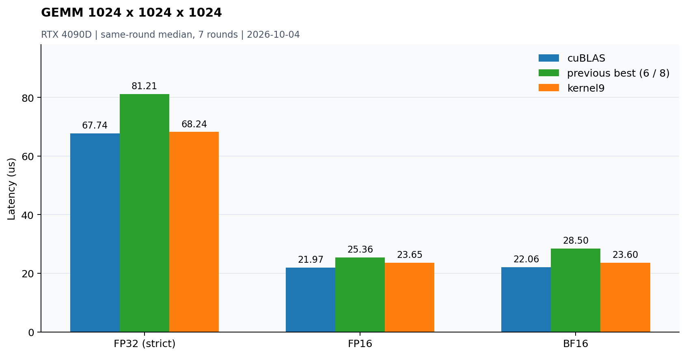

# CUDA GEMM：固定1024³

源码：[gemm_forward.cu](../dev/cuda/gemm_forward.cu)、[共用数学内核](../dev/cuda/gemm_kernels.cuh)、[common.h](../dev/cuda/common.h)。只实现前向`C=A@B`，全部行主序，alpha=1/beta=0；M=N=K=1024，FP32累加，输入输出三种精度。严格FP32路径不使用TF32。



## 优化演进

kernel1 native → kernel2 cuBLAS → kernel3 shared tile → kernel4寄存器分块 → kernel5向量加载/XOR布局 → kernel6预取双池 → kernel7 cp.async → kernel8 WMMA → kernel9操作数流水线及显式ldmatrix/mma。

kernel9 FP32采用64×64×16、128线程、shared双池和register操作数双缓冲。FP16/BF16采用32×64×32、4warps，warp16×32，XOR shared布局、ldmatrix/mma.sync和成对输出写回，省去shared输出重排。

## 同轮实测

2026-10-04，RTX 4090D物理GPU1、CUDA12.4.99；预热5次、热缓存、CUDA Event、7轮每轮200 repeats，比较顺序轮换取中位数，未锁时钟。单位μs。上一版最佳为FP32 kernel6、FP16/BF16 kernel8。

| dtype | cuBLAS | 上一版最佳 | kernel9 | 相对cuBLAS吞吐 |
|---|---:|---:|---:|---:|
| FP32 | 67.740 | 81.215 | 68.239 | 99.3% |
| FP16 | 21.971 | 25.356 | 23.648 | 92.9% |
| BF16 | 22.063 | 28.497 | 23.601 | 93.5% |

百分比=cuBLAS中位耗时/kernel9中位耗时×100%。这是该硬件/形状/精度口径的算子吞吐，不代表推理框架端到端性能。FP32约持平，低精度仍有约6–7%吞吐差距。

## 资源、同步与剩余差距

编译器/cuobjdump：FP32 kernel9为113 registers/16384B shared，FP16/BF16为80 registers/16384B shared，LOCAL/STACK=0。SASS确认向量访存和HMMA路径。shared读写采用一致XOR映射；异步wait后仍需block barrier。尾部和shared复用的同步分别验证。

当前4090服务器没有可用NCU counter权限，bank冲突论证来自静态地址/事务分析，未声称实测全kernel零冲突。资源占用、指令调度与流水线效率仍可能造成差距；额外split-K需要计入归约与workspace，不能假定更快。

## 正确性与范围

既有54-case测试包括小矩阵、尾块、两随机种子和零输入，全量与cuBLAS对比及CPU double抽查。kernel9另有全grid memcheck和实际输入单CTA racecheck/synccheck；不能把单CTA检查表述为全grid racecheck。kernel5~9只支持1024³，其他形状报错；回归尺寸使用早期版本。

```bash
mkdir -p result/build
nvcc -O3 -std=c++17 -arch=sm_89 dev/cuda/gemm_forward.cu -lcublas -o result/build/gemm_forward
./result/build/gemm_forward --m 1024 --n 1024 --k 1024 --dtype fp16 --kernel 9
./result/build/gemm_forward --self-test
```
