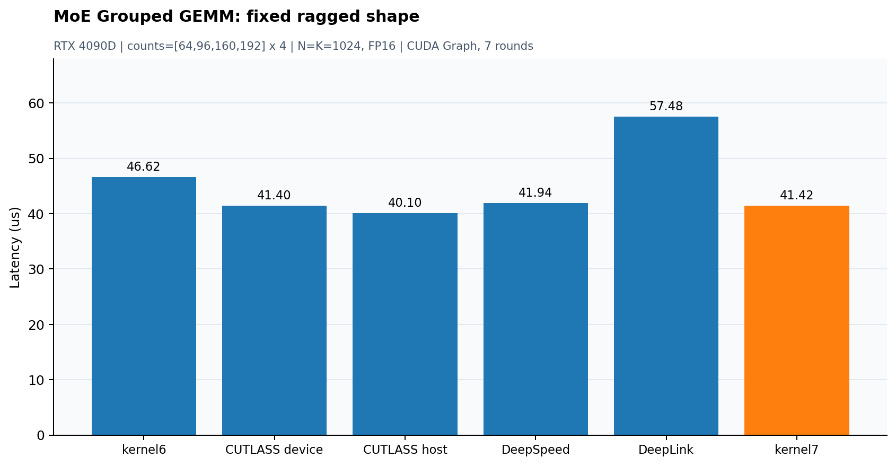

# MoE Grouped GEMM：固定不均匀专家维度

源码：[moe_grouped_gemm_forward.cu](../dev/cuda/moe_grouped_gemm_forward.cu)、[可选CUTLASS对照](../dev/cuda/gemm_cutlass.cuh)。固定`counts=[64,96,160,192]×4`，E=16、总M=2048、N=K=1024，FP16输入输出、FP32累加。A/C按专家打包，B[E,K,N]行主序，alpha=1/beta=0。仅单层专家GEMM前向，不包含router、gather/scatter、gate、激活、通信或反向。



## 实现与调参

保留native、逐专家cuBLAS loop、shared/register SIMT、可选CUTLASS和通用kernel6。kernel7精确匹配上述形状与FP16才走固定路径，其他输入明确打印fallback并调用kernel6。

最终CTA32×128×32、warp32×32、128threads、512个有效输出tile；16B向量cp.async、三层shared流水线、紧凑线性地址XOR、B的ldmatrix.x4.trans。停止提交时wait_group0排空，barrier保证其他线程看到已完成拷贝。任务按专家/N tile/M tile排列，以增加B缓存复用机会。寄存器双缓冲在此布局更慢，最终保留单组操作数寄存器。

三轮共408个自研扫描项，含跨轮重复；同输入初轮另扫描228个可运行开源候选。CUTLASS DeviceOnly/HostPrecompute均扫描CTA/warp/stages和block数；DeepSpeed/DeepLink扫描原始配置集，选择阶段和JIT排除。不是全局穷举，也没有把未调参的kernel5当作开源最优。

## 最终同轮实测

2026-10-05，RTX 4090D物理GPU1、CUDA12.4.99、PyTorch2.9+cu128、Triton3.5。独立stream、128节点CUDA Graph、7轮顺序轮换、每轮10replay，热缓存，未锁时钟；输入、输出、tile metadata和workspace预分配，CPU预计算/上传及框架包装器排除。单位μs。

| 实现 | 中位耗时 |
|---|---:|
| kernel6 | 46.622 |
| cutlass_device | 41.404 |
| cutlass_host | 40.096 |
| cutlass_extra | 56.278 |
| deepspeed | 41.945 |
| deeplink | 57.480 |
| kernel7 | 41.425 |

kernel7比kernel6耗时减少11.1%，吞吐提高12.5%，约103.68TFLOP/s；相对本次候选集中最快开源CUTLASS HostPrecompute吞吐为96.8%。与DeviceOnly差异不足1%，视为近似持平。图省略较慢的额外CUTLASS大tile列，表保留完整结果。

选定CUTLASS为CTA32×128×32、warp16×64×32、3 stages；DeepSpeed为32×128×32、8warps、4stages；DeepLink为128×256×64、GROUP_M10、8warps、3stages。NN布局对照共享同一量化输入，不混入要求B[E,N,K]的NT布局转换结果。源码出处：[CUTLASS](https://github.com/NVIDIA/cutlass)、[DeepSpeed](https://github.com/deepspeedai/DeepSpeed)、[DeepLink](https://github.com/DeepLink-org/Triton_Grouped_GEMM)。

## 正确性与证据限制

141个自测case：138个通用shape/dtype上的kernel6 fallback，3个固定目标seed0/17及零输入。另对6种随机/结构化输入全输出与cuBLAS比较，每专家257个CPU double抽查；固定目标所有7版对比通过。完整固定目标memcheck/racecheck/synccheck均无错误或hazard。

最终96registers/thread、30720B动态shared、LOCAL/STACK=0。静态地址检查验证双射、16B连续对齐和对应ldmatrix行事务的bank分区；没有NCU counter，不将其写成全kernel实测零bank冲突。HostPrecompute仍约快3.3%，后续应继续验证资源、指令调度与流水线，而不是机械加入更多策略。

```bash
mkdir -p result/build
nvcc -O3 -std=c++17 -arch=sm_89 dev/cuda/moe_grouped_gemm_forward.cu -lcublas -o result/build/moe_grouped_gemm_forward
./result/build/moe_grouped_gemm_forward --counts 64,96,160,192,64,96,160,192,64,96,160,192,64,96,160,192 --n 1024 --k 1024 --dtype fp16 --kernel 7
./result/build/moe_grouped_gemm_forward --self-test --kernel 7
```
