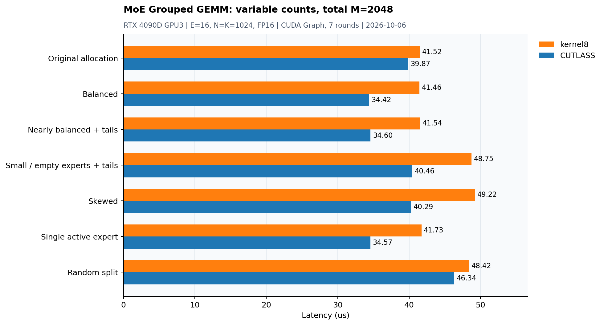

# MoE Grouped GEMM：专家分组矩阵乘优化

源码：[moe_grouped_gemm_forward.cu](../dev/cuda/moe_grouped_gemm_forward.cu)、[可选CUTLASS对照](../dev/cuda/gemm_cutlass.cuh)。kernel7固定`counts=[64,96,160,192]×4`，E=16、总M=2048、N=K=1024，FP16输入输出、FP32累加。A/C按专家打包，B[E,K,N]行主序，alpha=1/beta=0。仅单层专家GEMM前向，不包含router、gather/scatter、gate、激活、通信或反向。


## 实现与调参

保留native、逐专家cuBLAS loop、shared/register SIMT、可选CUTLASS和通用kernel6。kernel7精确匹配上述形状与FP16才走固定路径，其他输入明确打印fallback并调用kernel6。

最终CTA32×128×32、warp32×32、128threads、512个有效输出tile；16B向量cp.async、三层shared流水线、紧凑线性地址XOR、B的ldmatrix.x4.trans。停止提交时wait_group0排空，barrier保证其他线程看到已完成拷贝。任务按专家/N tile/M tile排列，以增加B缓存复用机会。寄存器双缓冲在此布局更慢，最终保留单组操作数寄存器。

三轮共408个自研扫描项，含跨轮重复；同输入初轮另扫描228个可运行开源候选。CUTLASS DeviceOnly/HostPrecompute均扫描CTA/warp/stages和block数；DeepSpeed/DeepLink扫描原始配置集，选择阶段和JIT排除。不是全局穷举，也没有把未调参的kernel5当作开源最优。

## 最终同轮实测

2026-10-05，RTX 4090D物理GPU1、CUDA12.4.99、PyTorch2.9+cu128、Triton3.5。独立stream、128节点CUDA Graph、7轮顺序轮换、每轮10replay，热缓存，未锁时钟；输入、输出、tile metadata和workspace预分配，CPU预计算/上传及框架包装器排除。单位μs。

| 实现 | 中位耗时 |
|---|---:|
| kernel6 | 46.622 |
| cutlass_device | 41.404 |
| cutlass_host | 40.096 |
| cutlass_extra | 56.278 |
| deepspeed | 41.945 |
| deeplink | 57.480 |
| kernel7 | 41.425 |

kernel7比kernel6耗时减少11.1%，吞吐提高12.5%，约103.68TFLOP/s；相对本次候选集中最快开源CUTLASS HostPrecompute吞吐为96.8%。与DeviceOnly差异不足1%，视为近似持平。图省略较慢的额外CUTLASS大tile列，表保留完整结果。

选定CUTLASS为CTA32×128×32、warp16×64×32、3 stages；DeepSpeed为32×128×32、8warps、4stages；DeepLink为128×256×64、GROUP_M10、8warps、3stages。NN布局对照共享同一量化输入，不混入要求B[E,N,K]的NT布局转换结果。源码出处：[CUTLASS](https://github.com/NVIDIA/cutlass)、[DeepSpeed](https://github.com/deepspeedai/DeepSpeed)、[DeepLink](https://github.com/DeepLink-org/Triton_Grouped_GEMM)。

## 正确性与证据限制

141个自测case：138个通用shape/dtype上的kernel6 fallback，3个固定目标seed0/17及零输入。另对6种随机/结构化输入全输出与cuBLAS比较，每专家257个CPU double抽查；固定目标所有7版对比通过。完整固定目标memcheck/racecheck/synccheck均无错误或hazard。

最终96registers/thread、30720B动态shared、LOCAL/STACK=0。静态地址检查验证双射、16B连续对齐和对应ldmatrix行事务的bank分区；没有NCU counter，不将其写成全kernel实测零bank冲突。HostPrecompute仍约快3.3%，后续应继续验证资源、指令调度与流水线，而不是机械加入更多策略。

```bash
mkdir -p result/build
nvcc -O3 -std=c++17 -arch=sm_89 dev/cuda/moe_grouped_gemm_forward.cu -lcublas -o result/build/moe_grouped_gemm_forward
./result/build/moe_grouped_gemm_forward --counts 64,96,160,192,64,96,160,192,64,96,160,192,64,96,160,192 --n 1024 --k 1024 --dtype fp16 --kernel 7
./result/build/moe_grouped_gemm_forward --self-test --kernel 7
```

## kernel8：总 M=2048，专家分配可变

保持E=16、N=K=1024、FP16输入输出和FP32累加，支持任意非负的16项counts，只要求其总和为2048。空专家不生成任务；每个专家的M不需要是32的倍数。范围外会明确提示回退到通用kernel6。kernel7及其固定分配路径保留。

kernel8复用kernel7的32×128×32计算核心及三阶段shared流水线。任务仍按专家/N tile/M tile排列，但M tile数量改为向上取整；A的无效行通过cp.async补零，输出按实际M屏蔽。同一已编译内核读取运行时counts和任务表，处理不同专家分配。counts变化时需要重新生成并上传任务表。

### 正确性与范围

`--self-test --kernel 8`通过162项回归，其中24项实际进入kernel8优化路径，其他138项验证通用回退。另检查总M=2047/2049及E=8的回退行为，均通过对拍。固定总M覆盖均匀、首/尾专家集中、空专家、M=1、非32倍数、偏斜和随机切分，两随机种子及零输入。另在下表7种分配上验证6类输入（三个随机种子、零输入、专家常量、单K非零），共42组全输出参考对拍及每个非空专家257个CPU double抽查。

对“小专家/空专家/尾块”“M=1与M=2047”“全部集中于最后专家”三种分配执行完整grid memcheck/racecheck/synccheck，共9次检查，均无错误或hazard。编译器显示kernel8为96 registers/thread、30720B动态shared，stack/spill为0。上述是有限分配与输入的验证，不代表穷举全部counts。

### 与CUTLASS同轮对比

2026-10-06，RTX 4090D物理GPU3、CUDA12.4.99、PyTorch2.9.0+cu128。每种分配分别扫描CUTLASS DeviceOnly/HostPrecompute的25种CTA/warp/stages配置，以及自动、114、228三个block数，共150个候选；短测筛选并复测前三名，再与kernel8做独立的同轮测量。不是全局穷举。CUTLASS源码版本沿用b2dd65dc864e09688245b316ac46c4a6cd07e15c。

最终计时使用独立stream、128节点CUDA Graph、7轮顺序轮换、每轮10 replay，热缓存，未锁时钟。输入输出与元数据预分配；不包含任务表生成、上传、内存分配、Graph构建或路由通信。动态counts的任务表设置开销不包含在下表中，因此这些结果不是端到端MoE时延，也不能与上一日不同GPU上的历史值直接计算改进比例。



| 分配 | 有效CTA数 | kernel8 (μs) | CUTLASS (μs) | 相对CUTLASS吞吐 |
|---|---:|---:|---:|---:|
| 原分配 | 512 | 41.521 | 39.867 | 96.0% |
| 均匀 | 512 | 41.461 | 34.422 | 83.0% |
| 近均匀尾块 | 520 | 41.543 | 34.602 | 83.3% |
| 小专家/空专家/尾块 | 576 | 48.746 | 40.464 | 83.0% |
| 偏斜 | 624 | 49.218 | 40.289 | 81.9% |
| 单专家集中 | 512 | 41.728 | 34.574 | 82.9% |
| 随机切分 | 584 | 48.418 | 46.337 | 95.7% |

相对吞吐=同轮CUTLASS中位耗时/kernel8中位耗时×100%。原分配下kernel7为41.347μs，kernel8为41.521μs，耗时差约0.4%。本轮主要扩展可用分配范围，两版在原分配上近似持平。

所有分配总M均为2048，但向上取整后的CTA数量不同，少量token的专家也会占一个完整M tile。CUTLASS在不同分配下可以选择不同分块，因此不能把原分配接近CUTLASS的结论推广到所有分配。当前kernel8保持一套计算分块，后续可针对尾块浪费与分块选择继续优化；没有NCU counter，未将差距归因于已测stall或bank冲突。

| 分配 | counts | 本次选定CUTLASS：CTA / warp / stages / blocks |
|---|---|---|
| 原分配 | 64,96,160,192,64,96,160,192,64,96,160,192,64,96,160,192 | host; 32×128×32 / 16×64 / 3 / 0 |
| 均匀 | 128,128,128,128,128,128,128,128,128,128,128,128,128,128,128,128 | host; 64×64×32 / 32×32 / 3 / 0 |
| 近均匀尾块 | 127,127,127,127,127,127,127,127,127,127,127,127,127,127,127,143 | host; 64×64×32 / 32×32 / 3 / 0 |
| 小专家/空专家/尾块 | 0,1,2,7,8,15,16,17,31,32,33,63,64,65,129,1565 | host; 64×128×32 / 32×64 / 3 / 228 |
| 偏斜 | 1536,35,35,34,34,34,34,34,34,34,34,34,34,34,34,34 | host; 64×128×32 / 32×64 / 4 / 228 |
| 单专家集中 | 2048,0,0,0,0,0,0,0,0,0,0,0,0,0,0,0 | host; 64×64×32 / 32×32 / 3 / 0 |
| 随机切分 | 78,79,79,158,195,132,450,344,10,88,158,6,79,38,146,8 | host; 32×128×32 / 16×64 / 3 / 0 |

### 运行

```bash
# 均匀分配：16个专家，每个M=128。
./result/build/moe_grouped_gemm_forward --m 2048 --experts 16 --n 1024 --k 1024 --dtype fp16 --kernel 8
# 包含空专家、M=1与尾块的分配，总数仍为2048。
./result/build/moe_grouped_gemm_forward --counts 1,0,0,0,0,0,0,0,0,0,0,0,0,0,0,2047 --n 1024 --k 1024 --dtype fp16 --kernel 8
./result/build/moe_grouped_gemm_forward --self-test --kernel 8
```
