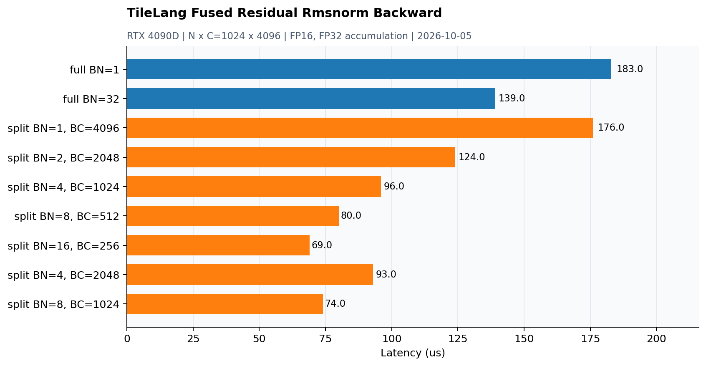

# TileLang Fused Residual RMSNorm Backward

源码：[dev/tilelang/fused_residual_rmsnorm_backward.py](../dev/tilelang/fused_residual_rmsnorm_backward.py)。2026-10-05补测：RTX 4090D物理GPU1，N×C=1024×4096，seed0；FP16输入/输出、FP32归约，backward的dw为FP32。



## 环境与计时

TileLang0.1.15开发checkout（revision d82101ff08acea8d3e3ca7d0ab40985a3ca2a781），PyTorch2.9.0+cu128、nvcc12.4.99；TileLang使用`tilelang-3032/.venv`，CC/CXX来自SCVideo的GCC12.4.0。GCC9无法完成该环境的C++20编译，正式测试使用GCC12和默认C++20标准。

原示例调用`tilelang.profiler.do_bench(warmup=25, rep=100)`：这两个参数是毫秒预算，默认CUDA Event、平均耗时、测量间清理L2；并非固定25/100次重复。JIT编译和正确性对拍不计时。backward计时含每次调用前的dw清零。示例wrapper也负责输出分配，故本页是该TileLang调用的时间，不能与排除分配/元数据的Grouped GEMM热缓存graph结果直接混比。

输出日志只保留到0.001ms，因此表和图以1μs粒度呈现，亚微秒差异无法判断。PyTorch参考含多个操作/Autograd图调度，不放进主图或将它作为单kernel的等价性能对照。

## 数据流与候选范围

先对每行的dy·x·w（融合版使用z）归约，计算dx；对dw在program内沿行维归约，再FP32 atomic_add到全局。split-C以较小fragment累计行内归约，第二遍逆序遍历通道块并写回。融合版同时写dx与dresidual，并验证两者一致。

整行BLOCK_N=1/32与原始7个split-C配置，共9项。**BLOCK_N=128未纳入性能/正确性结论**：RMSNorm backward在GCC12的ptxas编译超过9分钟仍未完成，因此停止该编译；fused backward同类大分块也未测试。kernel定义保留，测试脚本只筛选顶层候选列表。

## 实测结果

| 配置 | 耗时 (μs) |
|---|---:|
| full BN=1 | 183 |
| full BN=32 | 139 |
| split BN=1, BC=4096 | 176 |
| split BN=2, BC=2048 | 124 |
| split BN=4, BC=1024 | 96 |
| split BN=8, BC=512 | 80 |
| split BN=16, BC=256 | 69 |
| split BN=4, BC=2048 | 93 |
| split BN=8, BC=1024 | 74 |

整行BN1为183μs，本次最快是split BN=16, BC=256的69μs，约2.65倍于整行基准吞吐。相同tile面积下，增加行方向并行、减少通道片段改变了归约和原子聚合的工作量；更大的面积也没有继续改善。没有NCU counter，未将具体差距归因于已测寄存器spill或某类stall。

## 正确性

autograd检查dx、dresidual、dw，另验证dx==dresidual及整行/split-C交叉对拍。 原示例使用`rtol=1e-2, atol=1e-2`。本页9个配置均在计时前通过对拍，有限shape/seed/精度测试不代表任意尺寸的验证。当前未采集此TileLang版本的NCU数据，也没有对这些JIT内核执行memcheck/racecheck，不能沿用手写CUDA的工具检查结论。

## 对拍参考修正

首次执行时dw有5/4096个元素超出原容差，最大差约0.02059。kernel输入是前向保存的`round_fp16(x+residual)`及其mean2，旧autograd参考却在未舍入的`x+residual`上求导，同时weight为FP16 leaf，dw参考也被量化。

参考改为：将实际保存的FP16 z转成FP32 leaf，对其独立autograd求dz；weight也用FP32 leaf，使dw保持FP32。最后将dz转换到存储dtype作为dx/dresidual。**kernel主体与原有rtol=atol=1e-2未改**，修正后本页所有9个配置通过。

## 复现

按服务器上实际使用的环境切换：

```bash
source /opt/anaconda3/etc/profile.d/conda.sh
conda activate SCVideo
export TILELANG_GCC_ROOT="$CONDA_PREFIX"
conda deactivate
cd /data/user4/tongleiwen/tilelang-3032
source .venv/bin/activate
export CC="$TILELANG_GCC_ROOT/bin/x86_64-conda-linux-gnu-cc"
export CXX="$TILELANG_GCC_ROOT/bin/x86_64-conda-linux-gnu-c++"
"$CXX" --version
python -c 'from tilelang.contrib.cc import get_cplus_compiler; print(get_cplus_compiler())'
cd /path/to/my_cuda_kernels
```

源码默认还会编译BLOCK_N128。若只复现本页范围，先将测试区BLOCK_N_LIST设为(1,32)，保持JIT kernel和split-C候选不变。源码默认候选列表保持不变。
