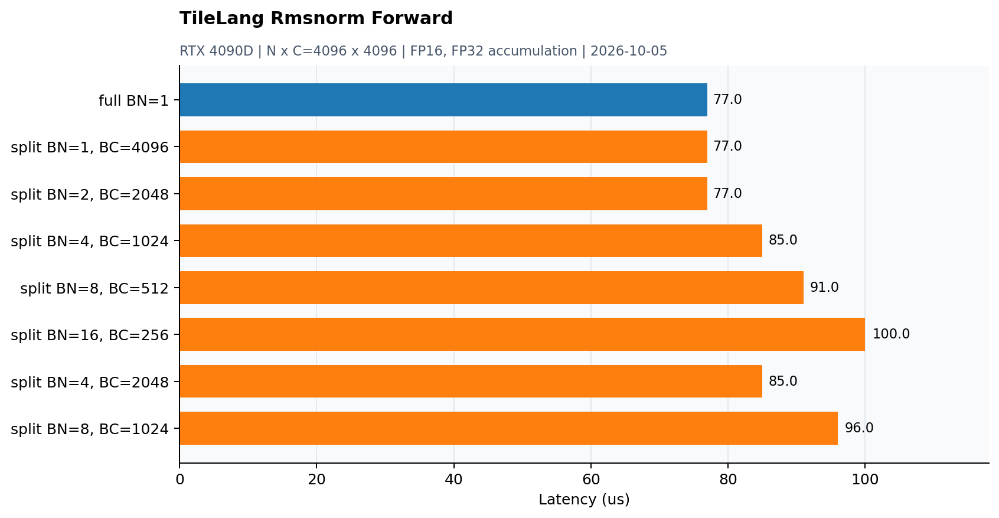

# TileLang RMSNorm Forward

源码：[dev/tilelang/rmsnorm_forward.py](../dev/tilelang/rmsnorm_forward.py)。2026-10-05补测：RTX 4090D物理GPU1，N×C=4096×4096，seed0；FP16输入/输出、FP32归约，backward的dw为FP32。



## 环境与计时

TileLang0.1.15开发checkout（revision d82101ff08acea8d3e3ca7d0ab40985a3ca2a781），PyTorch2.9.0+cu128、nvcc12.4.99；TileLang使用`tilelang-3032/.venv`，CC/CXX来自SCVideo的GCC12.4.0。GCC9无法完成该环境的C++20编译，正式测试使用GCC12和默认C++20标准。

原示例调用`tilelang.profiler.do_bench(warmup=25, rep=100)`：这两个参数是毫秒预算，默认CUDA Event、平均耗时、测量间清理L2；并非固定25/100次重复。JIT编译和正确性对拍不计时。backward计时含每次调用前的dw清零。示例wrapper也负责输出分配，故本页是该TileLang调用的时间，不能与排除分配/元数据的Grouped GEMM热缓存graph结果直接混比。

输出日志只保留到0.001ms，因此表和图以1μs粒度呈现，亚微秒差异无法判断。PyTorch参考含多个操作/Autograd图调度，不放进主图或将它作为单kernel的等价性能对照。

## 数据流与候选范围

整行版在fragment中保存一行，完成平方和归约后写回；split-C版本按通道块循环，先累加平方和，再生成输出。RMSNorm split-C需再次读取x；扩大BLOCK_N可以增加每个program处理的行数，但也增加fragment/寄存器需求。

整行BLOCK_N=1与原始7个split-C配置，共8项。

## 实测结果

| 配置 | 耗时 (μs) |
|---|---:|
| full BN=1 | 77 |
| split BN=1, BC=4096 | 77 |
| split BN=2, BC=2048 | 77 |
| split BN=4, BC=1024 | 85 |
| split BN=8, BC=512 | 91 |
| split BN=16, BC=256 | 100 |
| split BN=4, BC=2048 | 85 |
| split BN=8, BC=1024 | 96 |

本次整行版77μs，最快split-C 77μs。split-C没有稳定优于整行版的证据；减少片段面积的收益不能自动抵消二次遍历和控制开销。

## 正确性

同时检查y和mean2，并将split-C结果与整行版交叉比较。 原示例使用`rtol=1e-2, atol=1e-2`。本页8个配置均在计时前通过对拍，有限shape/seed/精度测试不代表任意尺寸的验证。当前未采集此TileLang版本的NCU数据，也没有对这些JIT内核执行memcheck/racecheck，不能沿用手写CUDA的工具检查结论。

## 复现

按服务器上实际使用的环境切换：

```bash
source /opt/anaconda3/etc/profile.d/conda.sh
conda activate SCVideo
export TILELANG_GCC_ROOT="$CONDA_PREFIX"
conda deactivate
cd /data/user4/tongleiwen/tilelang-3032
source .venv/bin/activate
export CC="$TILELANG_GCC_ROOT/bin/x86_64-conda-linux-gnu-cc"
export CXX="$TILELANG_GCC_ROOT/bin/x86_64-conda-linux-gnu-c++"
"$CXX" --version
python -c 'from tilelang.contrib.cc import get_cplus_compiler; print(get_cplus_compiler())'
cd /path/to/my_cuda_kernels
```

直接执行`CUDA_VISIBLE_DEVICES=1 python dev/tilelang/rmsnorm_forward.py`，使用原始全部候选。
