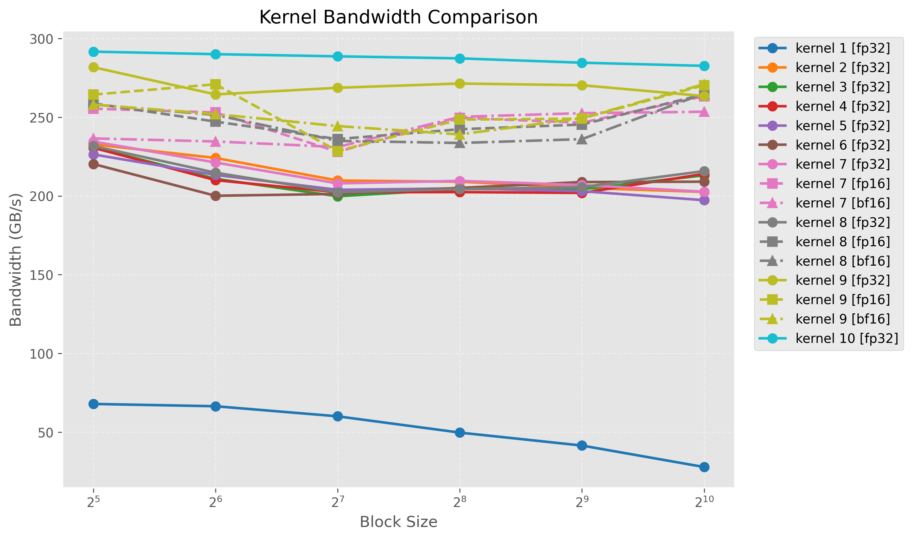
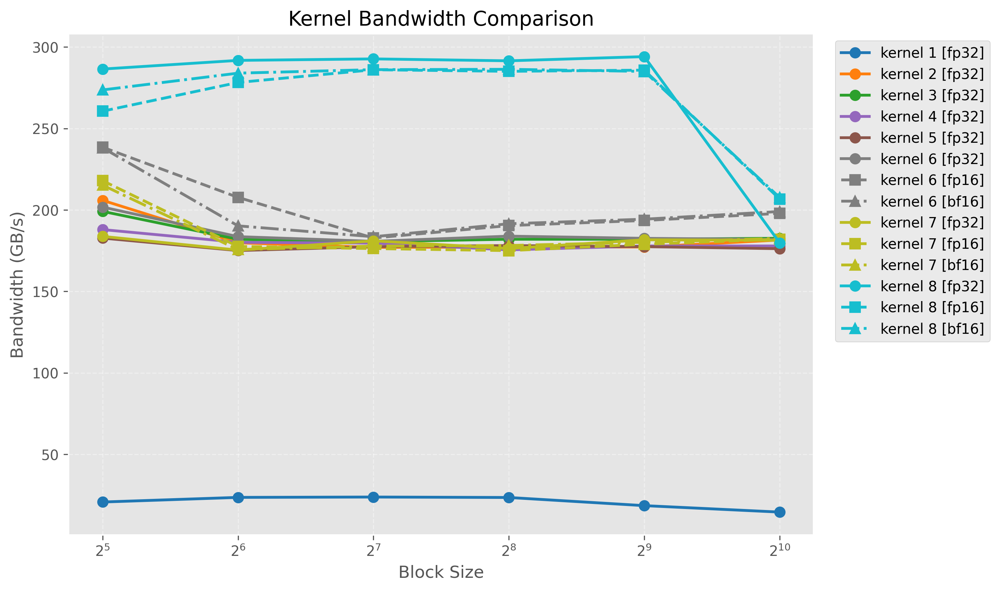
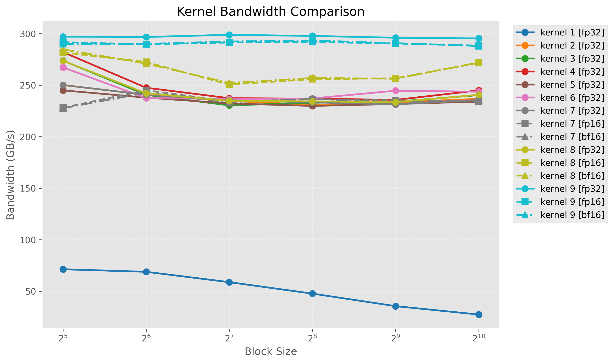
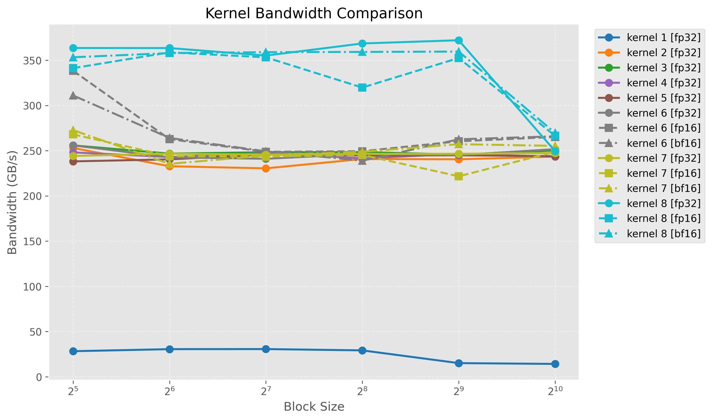

# CUDA RMSNorm Kernels

从数学公式、CPU 参考实现到高性能 CUDA kernel 的完整 RMSNorm 算子项目。

这是一个面向开源发布的 CUDA 算子性能工程项目，独立实现了 RMSNorm 与
Fused Residual RMSNorm 的前向、反向传播，覆盖
FP32、FP16 和 BF16。每个算子都保留从朴素实现到优化实现的完整演进路径，并通过
CPU 对拍、CUDA Event、Nsight Systems 和 Nsight Compute 验证正确性与性能。

项目不依赖 PyTorch、CUTLASS 或其他算子库；每个 `.cu` 文件都可以直接使用 `nvcc`
编译运行，适合阅读 CUDA 优化思路、复现实验或继续扩展新的 kernel。

## 项目亮点

- **完整算子闭环**：实现 RMSNorm、Fused Residual RMSNorm 的 forward/backward。
- **三种存储精度**：支持 FP32、FP16、BF16，核心归约统一使用 FP32 累加。
- **可读的优化阶梯**：从一线程一行逐步演进到 warp 归约、向量化、共享内存、
  persistent grid、single-pass 和寄存器分层归约。
- **精度专用 kernel**：为固定 `C=768` 的常用 shape 提供独立 FP32/FP16/BF16
  优化路径，同时为其他 shape 保留通用回退实现。
- **内置正确性验证**：每个可执行程序先与 CPU double-accumulation 参考结果对拍，
  再遍历多组 block size 进行性能测试。
- **Profiler 驱动优化**：结合 DRAM Throughput、Achieved Occupancy、寄存器数量和
  atomic 指令定位瓶颈，而不是只比较耗时。

## 算子定义

设一行输入为 $x\in\mathbb{R}^{C}$，可学习权重为 $w$，常数为 $\epsilon$。

### RMSNorm Forward

$$
m=\frac{1}{C}\sum_{i=1}^{C}x_i^2,\qquad
r=\frac{1}{\sqrt{m+\epsilon}},\qquad
y_i=x_iw_ir
$$

### RMSNorm Backward

给定上游梯度 $dy$：

$$
s=\sum_{i=1}^{C}dy_iw_ix_i
$$

$$
dx_i=r\left(dy_iw_i-x_i\frac{r^2}{C}s\right)
$$

$$
dw_i=\sum_{n}dy_{n,i}x_{n,i}r_n
$$

其中 `dx` 是行内归约问题，`dw` 还需要跨行归约，也是 backward 中原子竞争的主要来源。

### Fused Residual RMSNorm

融合版本首先计算：

$$
z=x+residual
$$

随后直接对 `z` 执行 RMSNorm。反向传播中，残差加法的两个输入共享相同梯度：

$$
dx=dresidual=dz
$$

融合实现减少了中间 kernel 启动，并为 `z` 的寄存器缓存提供了进一步优化空间。

## Kernel 演进

项目没有只保留最终版本，而是保留每一个关键优化阶段，方便比较某项技术在真实算子上的
收益与代价。

| 算子 | 版本 | 主要优化 |
|---|---:|---|
| RMSNorm Forward | 1 | 一线程处理一行的朴素实现 |
| | 2 | 一 warp 处理一行，shuffle 完成归约 |
| | 3–4 | `float2` / `float4` 向量化访存 |
| | 5 | 共享内存缓存 weight |
| | 6 | grid-stride、`__ldg` 与尾部处理 |
| | 7–8 | FP32/FP16/BF16 混合精度与 vec2 |
| | 9 | 共享内存缓存 x 的 single-pass 实现 |
| | 10 | FP32 寄存器缓存 x + float4 single-pass |
| RMSNorm Backward | 1–2 | 朴素全局原子累加 → warp 行内归约 |
| | 3–5 | block 内 `dw` 聚合、persistent grid、vec2 |
| | 6–7 | 混合精度 shared / persistent 实现 |
| | 8 | 三精度独立实现，寄存器累计 `dw` 后分层归并 |
| Fused Forward | 1–6 | warp 归约、向量化、共享缓存与 grid-stride |
| | 7–8 | 混合精度标量 / vec2 |
| | 9 | 三精度独立实现，寄存器缓存 `z`，避免二次读取 |
| Fused Backward | 1–5 | warp 归约、shared `dw`、persistent 与 vec2 |
| | 6–7 | 混合精度 shared / persistent 实现 |
| | 8 | 三精度独立实现，寄存器分层归约 `dw` |

### 关键优化判断

1. **Warp 协作是最重要的第一步。** 一线程一行会产生串行归约和跨行非合并访存；
   一 warp 一行同时解决行内并行、合并访存和快速归约。
2. **向量化不等于减少流量。** `float2`/`float4` 可以减少访存指令，但在纯带宽受限阶段，
   更高的寄存器压力可能抵消收益。
3. **Forward 的重点是 single-pass。** 将当前行保存在共享内存或寄存器中，可以避免归约后
   再次从全局内存读取输入。
4. **Backward 的重点是 `dw`。** 直接对每个元素执行 `atomicAdd` 会形成热点；最终版本让
   warp 在寄存器中累计局部 `dw`，再进行 block 级归并。
5. **最优实现与 dtype 有关。** FP32、FP16、BF16 的数据流量、转换指令和寄存器需求不同，
   因此最终专用版本没有强行写成同一个模板 kernel。

## 参考性能

测试环境：NVIDIA RTX 3060 Laptop，Compute Capability 8.6，`N=8192`、`C=768`、
block size 256。表中时间来自 Nsight Compute 捕获的单次 kernel Duration。

### FP32：从朴素实现到最终版本

| 算子 | 最终版本 | Naive | Optimized | 加速比 |
|---|---|---:|---:|---:|
| RMSNorm Forward | kernel10 | 1330.00 μs | **161.31 μs** | **8.2×** |
| RMSNorm Backward | kernel8 | 4520.00 μs | **254.11 μs** | **17.8×** |
| Fused Residual RMSNorm Forward | kernel9 | 2680.00 μs | **332.38 μs** | **8.1×** |
| Fused Residual RMSNorm Backward | kernel8 | 5330.00 μs | **331.46 μs** | **16.1×** |

### 低精度专用路径

| 算子 | 推荐精度/版本 | Duration | 相对最终 FP32 |
|---|---|---:|---:|
| RMSNorm Forward | BF16 kernel7 | **98.75 μs** | 1.63× |
| RMSNorm Backward | FP16 kernel8 | **122.43 μs** | 2.08× |
| Fused Residual RMSNorm Forward | BF16 kernel9 | **159.94 μs** | 2.08× |
| Fused Residual RMSNorm Backward | FP16 kernel8 | **162.18 μs** | 2.04× |

### 最新专用版本的 Block256 Benchmark

Benchmark 使用 CUDA Event 计时，并在每次测量前清理 L2 cache。带宽按照各算子的逻辑必要
流量计算，因此是用于比较 kernel 的有效带宽，不等同于 NCU 采样的物理 DRAM 带宽。

| 算子 | 版本 | 精度 | Time | 有效带宽 |
|---|---|---|---:|---:|
| RMSNorm Forward | kernel9 | FP32 | 0.1854 ms | 271.48 GB/s |
| | kernel9 | FP16 | 0.1012 ms | 248.56 GB/s |
| | kernel9 | BF16 | 0.1052 ms | 239.13 GB/s |
| | kernel10 | FP32 | **0.1751 ms** | **287.45 GB/s** |
| RMSNorm Backward | kernel8 | FP32 | 0.2591 ms | 291.51 GB/s |
| | kernel8 | FP16 | 0.1326 ms | 285.06 GB/s |
| | kernel8 | BF16 | **0.1320 ms** | **286.29 GB/s** |
| Fused Residual RMSNorm Forward | kernel9 | FP32 | 0.3382 ms | 297.78 GB/s |
| | kernel9 | FP16 | 0.1725 ms | 291.94 GB/s |
| | kernel9 | BF16 | **0.1717 ms** | **293.38 GB/s** |
| Fused Residual RMSNorm Backward | kernel8 | FP32 | 0.3415 ms | 368.53 GB/s |
| | kernel8 | FP16 | 0.1969 ms | 319.78 GB/s |
| | kernel8 | BF16 | **0.1753 ms** | **359.18 GB/s** |

### 最新专用版本的 Block256 NCU 指标

| 算子 | 版本 | 精度 | Duration | DRAM | Compute | Occupancy | Registers |
|---|---|---|---:|---:|---:|---:|---:|
| RMSNorm Forward | kernel9 | FP32 | 185.18 μs | 81.69% | 26.63% | 67.19% | 39 |
| | kernel9 | FP16 | 101.66 μs | 74.26% | 48.53% | 97.17% | 39 |
| | kernel9 | BF16 | 102.53 μs | 75.08% | 48.50% | 95.61% | 39 |
| | kernel10 | FP32 | **161.31 μs** | **91.37%** | 6.04% | 54.36% | 63 |
| RMSNorm Backward | kernel8 | FP32 | 254.11 μs | 89.05% | 13.32% | 31.83% | 128 |
| | kernel8 | FP16 | **122.43 μs** | 89.63% | 33.21% | 31.19% | 114 |
| | kernel8 | BF16 | 125.41 μs | 88.19% | 33.93% | 32.25% | 116 |
| Fused Residual RMSNorm Forward | kernel9 | FP32 | 332.38 μs | 90.97% | 4.43% | 58.16% | 55 |
| | kernel9 | FP16 | 161.25 μs | 91.57% | 15.64% | 90.84% | 40 |
| | kernel9 | BF16 | **159.94 μs** | **92.26%** | 15.93% | 89.79% | 40 |
| Fused Residual RMSNorm Backward | kernel8 | FP32 | 331.46 μs | 90.94% | 12.69% | 29.69% | 128 |
| | kernel8 | FP16 | **162.18 μs** | **90.30%** | 30.64% | 30.32% | 114 |
| | kernel8 | BF16 | 168.54 μs | 88.06% | 30.11% | 32.69% | 114 |

这些结果用于展示当前硬件和 shape 下的优化趋势，不代表其他 GPU 或输入规模上的固定排序。
有效带宽与物理 DRAM 带宽也不是同一个概念：缓存命中、写合并和逻辑字节统计都会影响前者。

## 完整实验结果

### 最新性能曲线

#### RMSNorm Forward



#### RMSNorm Backward



#### Fused Residual RMSNorm Forward



#### Fused Residual RMSNorm Backward



### 结果索引

| 批次 | 内容 | 数据入口 |
|---|---|---|
| 20260828 | 初始四算子 benchmark | [`result/20260828`](result/20260828/) |
| 20260829 | warp、向量化和融合版本对比 | [`result/20260829`](result/20260829/) |
| 20260831 | 混合精度与统一绘图格式 | [`result/20260831`](result/20260831/) |
| 20260901 | block32/block256 NCU 指标汇总、CSV 与 profiler 分析 | [分析](result/20260901/result/analysis.md) · [block32 图](result/20260901/result/ncu_block32.png) · [block256 图](result/20260901/result/ncu_block256.png) · [block32 CSV](result/20260901/result/ncu_summary_block32.csv) · [block256 CSV](result/20260901/result/ncu_summary_block256.csv) |
| 20260902 | RMSNorm Forward kernel9/10 | [分析](result/20260902/rmsnorm_forward/analysis.md) · [benchmark](result/20260902/rmsnorm_forward/rmsnorm_forward.txt) · [全部 NCU 报告](result/20260902/rmsnorm_forward/) |
| 20260902 | RMSNorm Backward kernel1–8 | [分析](result/20260902/rmsnorm_backward/analysis.md) · [benchmark](result/20260902/rmsnorm_backward/rmsnorm_backward.txt) · [全部 NCU 报告](result/20260902/rmsnorm_backward/) |
| 20260902 | Fused Forward kernel1–9 | [分析](result/20260902/fused_residual_rmsnorm_forward/analysis.md) · [benchmark](result/20260902/fused_residual_rmsnorm_forward/fused_residual_rmsnorm_forward.txt) · [全部 NCU 报告](result/20260902/fused_residual_rmsnorm_forward/) |
| 20260902 | Fused Backward kernel1–8 | [分析](result/20260902/fused_residual_rmsnorm_backward/analysis.md) · [benchmark](result/20260902/fused_residual_rmsnorm_backward/fused_residual_rmsnorm_backward.txt) · [全部 NCU 报告](result/20260902/fused_residual_rmsnorm_backward/) |

每个 20260902 算子目录都包含：完整 benchmark 输出、统一风格性能曲线、逐版本分析，以及
block256 下各 kernel/dtype 的 Nsight Compute `--page details` 文本。

## 项目结构

```text
.
├── dev/
│   ├── common.h
│   ├── rmsnorm_forward.cu
│   ├── rmsnorm_backward.cu
│   ├── fused_residual_rmsnorm_forward.cu
│   └── fused_residual_rmsnorm_backward.cu
├── result/
│   ├── 20260828/
│   ├── 20260829/
│   ├── 20260831/
│   ├── 20260901/
│   ├── 20260902/
│   └── plot_benchmark.py
└── readme.md
```

- [`dev/common.h`](dev/common.h)：CUDA 错误检查、dtype 转换、对拍和 benchmark 工具。
- [`dev/rmsnorm_forward.cu`](dev/rmsnorm_forward.cu)：RMSNorm 前向及 kernel1–10。
- [`dev/rmsnorm_backward.cu`](dev/rmsnorm_backward.cu)：RMSNorm 反向及 kernel1–8。
- [`dev/fused_residual_rmsnorm_forward.cu`](dev/fused_residual_rmsnorm_forward.cu)：融合前向及 kernel1–9。
- [`dev/fused_residual_rmsnorm_backward.cu`](dev/fused_residual_rmsnorm_backward.cu)：融合反向及 kernel1–8。
- [`result/plot_benchmark.py`](result/plot_benchmark.py)：统一解析 benchmark 文本并绘制带宽曲线。

## 环境要求

- NVIDIA GPU；建议 Ampere 或更新架构以获得原生 BF16 支持。
- CUDA Toolkit，支持 C++17 的 `nvcc`。
- Nsight Systems / Nsight Compute，用于性能分析，可选。
- Python 3、Matplotlib 和 NumPy，用于重新生成曲线，可选。

## 编译

以下示例以 Compute Capability 8.6 为目标；请根据 GPU 修改 `-arch`。

```bash
nvcc -O3 -std=c++17 -arch=sm_86 --use_fast_math \
  dev/rmsnorm_forward.cu -o dev/rmsnorm_forward

nvcc -O3 -std=c++17 -arch=sm_86 --use_fast_math \
  dev/rmsnorm_backward.cu -o dev/rmsnorm_backward

nvcc -O3 -std=c++17 -arch=sm_86 --use_fast_math \
  dev/fused_residual_rmsnorm_forward.cu -o dev/fused_residual_rmsnorm_forward

nvcc -O3 -std=c++17 -arch=sm_86 --use_fast_math \
  dev/fused_residual_rmsnorm_backward.cu -o dev/fused_residual_rmsnorm_backward
```

## 运行

命令行参数用于选择 kernel 版本：

```bash
# RMSNorm Forward：FP32 寄存器 single-pass
./dev/rmsnorm_forward 10

# RMSNorm Backward：运行 kernel8 的 FP32/FP16/BF16
./dev/rmsnorm_backward 8

# Fused Residual RMSNorm Forward：运行 kernel9 的三种精度
./dev/fused_residual_rmsnorm_forward 9

# Fused Residual RMSNorm Backward：运行 kernel8 的三种精度
./dev/fused_residual_rmsnorm_backward 8
```

程序会执行以下流程：

1. 生成固定随机输入；
2. 使用 CPU double 归约实现计算参考结果；
3. 遍历 block size `32/64/128/256/512/1024` 做正确性对拍；
4. 清理 L2 cache 后使用 CUDA Event 重复计时；
5. 输出延迟与按算子逻辑流量计算的有效带宽。

## 正确性设计

GPU 并行归约与 CPU 顺序归约的加法顺序不同，不能使用逐 bit 相等作为判断标准。本项目采用：

- CPU 参考中的归约和 `dw` 累加使用 double；
- GPU 核心计算使用 FP32；
- 输出存储根据运行版本使用 FP32、FP16 或 BF16；
- 对不同 dtype 设置对应的绝对误差与相对误差容限；
- `dw` 单独检查，因为跨行原子累加会产生正常的浮点顺序误差。

还可以使用 NVIDIA Compute Sanitizer 检查内存和同步问题：

```bash
compute-sanitizer --tool memcheck  ./dev/rmsnorm_backward 8
compute-sanitizer --tool racecheck ./dev/fused_residual_rmsnorm_backward 8
compute-sanitizer --tool synccheck ./dev/fused_residual_rmsnorm_forward 9
```

## 使用 Nsight Systems 分析时间线

Nsight Systems 用于观察 kernel 启动、CUDA API 调用和 GPU 时间线：

```bash
nsys profile --trace=cuda -o /tmp/fused_rmsnorm \
  ./dev/fused_residual_rmsnorm_forward 9

nsys stats --report cuda_gpu_kern_sum /tmp/fused_rmsnorm.nsys-rep
```

重点确认：

- kernel 启动数量是否符合预期；
- 是否存在意外同步；
- CPU launch 与 GPU 执行之间是否存在空洞；
- 融合实现是否减少了中间 kernel 和显存往返。

## 使用 Nsight Compute 定位瓶颈

下面的命令捕获 RMSNorm Forward kernel10 在 block256 benchmark 中的一次 launch：

```bash
ncu -f -o /tmp/rmsnorm_forward_k10_b256 \
  --set full \
  --kernel-name rmsnorm_forward_kernel10 \
  --launch-skip 6006 \
  --launch-count 1 \
  ./dev/rmsnorm_forward 10

ncu -i /tmp/rmsnorm_forward_k10_b256.ncu-rep --page details
```

常用判断指标：

| 指标 | 用途 |
|---|---|
| `Duration` | 单次 kernel 的实际执行时间 |
| `DRAM Throughput` | 判断是否接近显存带宽上限 |
| `Compute (SM) Throughput` | 判断计算管线是否饱和 |
| `Achieved Occupancy` | 判断活跃 warp 是否足以隐藏延迟 |
| `Registers Per Thread` | 检查寄存器压力是否限制 occupancy |
| `Long Scoreboard` | 识别等待全局内存依赖造成的 stall |
| RED / ATOM 指令 | 分析 backward 中 `dw` 归约的原子热点 |

典型分析顺序是：先用 CUDA Event 找到性能差异，再用 Nsight Systems 确认调用结构，最后用
Nsight Compute 判断瓶颈属于 DRAM、计算、occupancy、寄存器还是原子竞争。

## 绘制 Benchmark 曲线

仓库提供统一绘图脚本，可读取一个或多个 benchmark 文本：

```bash
python result/plot_benchmark.py \
  result/20260902/rmsnorm_forward/rmsnorm_forward.txt \
  -o /tmp/rmsnorm_forward.png
```

脚本会自动识别 kernel 编号、dtype、block size 和带宽，并为 FP32、FP16、BF16 使用一致的
线型与标记。

## 可以继续扩展的方向

- 为更多 `C` 和 batch/token shape 自动选择 kernel；
- 将固定 shape 专用化扩展为编译期 shape dispatch；
- 比较 block-level atomic 与 two-stage partial-`dw` reduction；
- 增加更多 GPU 架构上的基准矩阵；
- 封装为可被深度学习框架调用的 C++/CUDA extension；
- 增加自动化 correctness、sanitizer 和性能回归测试。

## 参与贡献

欢迎提交新的 GPU 架构测试、shape 专用实现、kernel 优化和正确性修复。性能相关改动建议
同时说明 GPU 型号、CUDA 版本、输入 shape、block size、基线版本和复测结果，确保结论可以
被其他开发者复现。
